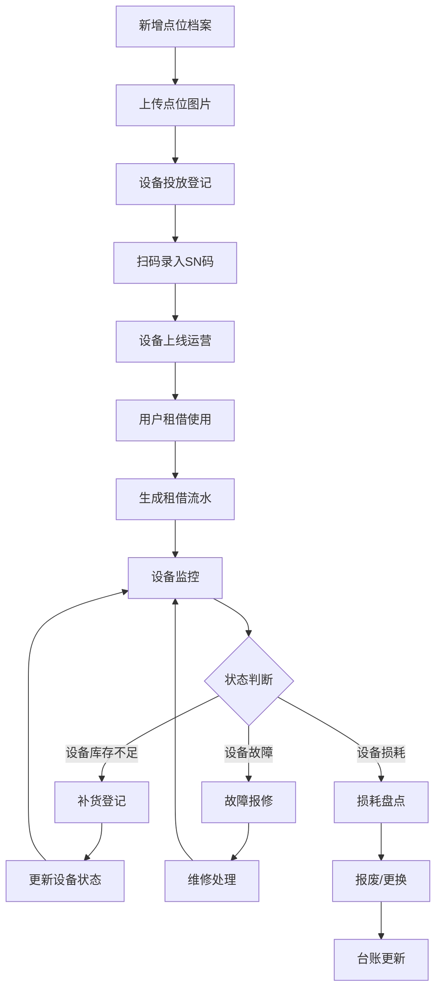

## 1. 产品概述

共享雨伞/充电宝站点运维管理系统，为运维人员提供全生命周期的站点设备管理能力，解决线下共享设备的投放、运营、维护、盘点等核心业务痛点。

- 面向运维管理团队，实现站点设备数字化管理
- 覆盖从点位选址、设备投放、日常运维到损耗盘点的完整业务闭环

## 2. 核心 Features

### 2.1 用户角色

| 角色 | 注册方式 | 核心权限 |
|------|----------|----------|
| 系统管理员 | 后台创建 | 全模块管理、用户权限配置、系统设置 |
| 运维主管 | 后台创建 | 数据查看、报表统计、任务分配、批量操作 |
| 运维人员 | 后台创建 | 故障报修、补货登记、设备状态更新 |

### 2.2 Feature 模块

1. **数据概览**：运营数据看板、关键指标统计、趋势图表
2. **点位档案**：站点信息管理、位置标注、图片上传、区域划分
3. **设备台账**：设备投放记录、状态追踪、SN码管理、设备信息维护
4. **故障报修**：故障登记、处理进度、维修记录、故障类型统计
5. **补货记录**：雨伞/充电宝补货登记、库存管理、补货人员追踪
6. **租借流水**：订单记录、收入统计、租借归还时间线、异常订单
7. **损耗盘点**：设备损耗登记、盘点报告、报废管理、损耗原因分析
8. **系统设置**：区域管理、数据导入导出、用户管理

### 2.3 页面详情

| 页面名称 | 模块名称 | Feature 描述 |
|----------|----------|--------------|
| 数据概览 | 统计看板 | 设备总数、在线率、今日订单、月度收入、故障数量等核心指标卡片 |
| 数据概览 | 图表区域 | 租借趋势折线图、设备状态饼图、区域柱状图、故障类型分布 |
| 点位档案 | 点位列表 | 表格展示点位名称、地址、区域、设备数量、状态、创建时间，支持筛选 |
| 点位档案 | 点位表单 | 新增/编辑点位，支持名称、地址、经纬度、区域、负责人、现场图片上传 |
| 设备台账 | 设备列表 | 设备编号、类型、SN码、所属点位、投放时间、状态、运行时长 |
| 设备台账 | 设备详情 | 设备完整信息、投放历史、故障记录、租借次数统计 |
| 故障报修 | 报修列表 | 故障单号、设备、点位、故障类型、上报时间、处理状态、处理人 |
| 故障报修 | 报修登记 | 选择设备、故障类型、描述、上传故障照片、紧急程度 |
| 补货记录 | 补货列表 | 补货单号、点位、补货类型、数量、补货时间、补货人员、备注 |
| 补货记录 | 补货登记 | 选择点位、雨伞/充电宝数量、库存校验、图片上传 |
| 租借流水 | 订单列表 | 订单号、用户、设备、点位、租借时间、归还时间、费用、状态 |
| 租借流水 | 统计分析 | 按日/周/月统计租借量、收入、热门点位排行 |
| 损耗盘点 | 盘点列表 | 盘点单号、盘点时间、盘点人员、损耗数量、状态 |
| 损耗盘点 | 损耗登记 | 设备选择、损耗类型、原因描述、处理方式、照片上传 |
| 公共组件 | 筛选器 | 按区域、时间范围、状态、关键词等多条件组合筛选 |
| 公共组件 | 批量操作 | 批量导入、批量导出、批量删除、批量状态更新 |

## 3. 核心流程

## 4. 用户界面设计

### 4.1 设计风格

- **主色调**：暖橙色系 #FF7A45（主色）、#FF9A6B（次色）、#FFD4B8（浅色）
- **辅助色**：深灰 #2D3436、中灰 #636E72、浅灰 #DFE6E9、背景 #FFF9F5
- **成功色**：#00B894、警告色：#FDCB6E、危险色：#E17055
- **按钮风格**：圆角 8px，主按钮实心橙色，次要按钮描边橙色
- **字体**：标题使用 Inter SemiBold，正文使用 Inter Regular，数字使用等宽字体
- **布局风格**：卡片式布局，顶部导航 + 侧边菜单 + 内容区三栏结构
- **图标风格**：线性图标，统一 24px 尺寸，橙色主色调
- **阴影**：柔和阴影 `0 4px 12px rgba(255, 122, 69, 0.1)`

### 4.2 页面设计概览

| 页面名称 | 模块名称 | UI 元素 |
|----------|----------|----------|
| 数据概览 | 统计看板 | 渐变橙色卡片、图标+数字组合、hover 上浮动效、趋势箭头 |
| 数据概览 | 图表区 | 折线图/饼图/柱状图，橙色系渐变填充，交互动效 |
| 列表页面 | 筛选栏 | 橙色边框输入框、下拉选择器、日期范围、圆角按钮 |
| 列表页面 | 数据表格 | 斑马纹、悬停高亮橙色、操作列按钮组、分页器 |
| 表单页面 | 表单控件 | 橙色聚焦边框、上传区域拖放高亮、标签页切换 |
| 详情页面 | 信息卡片 | 橙色标题下划线、分栏布局、状态标签彩色 |

### 4.3 响应式

- Desktop-first 设计，主内容区最小宽度 1200px
- 侧边栏可折叠，适配 1024px 以上屏幕
- 表格支持横向滚动，移动端数据卡片化展示
- 表单控件自适应宽度，按钮最小点击区域 44x44px

### 4.4 动效设计

- 页面加载：内容区渐入 + 向上偏移 16px，stagger 100ms
- 卡片 hover：向上浮动 4px，阴影加深，过渡 300ms
- 按钮点击：缩放 0.95，过渡 150ms
- 数据刷新：数字滚动动画，图表重绘过渡
- 侧边栏折叠：宽度过渡 300ms，图标弹性动画
