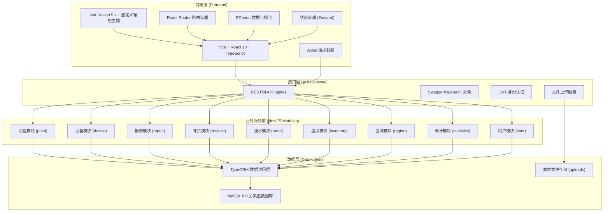
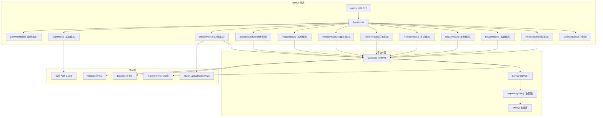
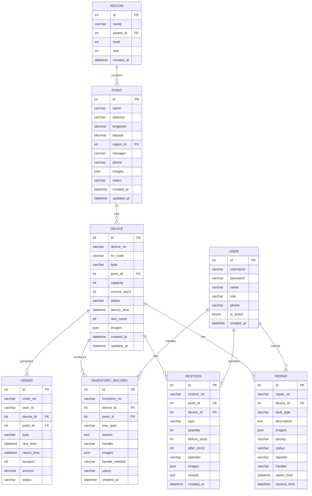

## 1. 架构设计



## 2. 技术描述

- **前端**: Vite 5.x + React 18 + TypeScript 5.x + Ant Design 5.x + Zustand + ECharts 5.x + React Router 6.x + Axios
- **UI 主题**: 暖橙色自定义主题，CSS Variables 全局样式变量
- **后端**: NestJS 10.x + TypeScript + TypeORM 0.3.x + MySQL 8.0
- **认证**: JWT + Passport，接口权限守卫
- **文件处理**: Multer 中间件处理图片上传，xlsx 库处理 Excel 导入导出
- **开发工具**: ESLint + Prettier + Concurrently（前后端并发启动）

## 3. 路由定义

| 前端路由 | 页面用途 | 对应后端接口前缀 |
|----------|----------|------------------|
| /dashboard | 数据概览 | /api/v1/statistics |
| /points | 点位档案列表 | /api/v1/points |
| /points/create | 新增点位 | /api/v1/points |
| /points/:id | 点位详情 | /api/v1/points/:id |
| /devices | 设备台账列表 | /api/v1/devices |
| /devices/create | 新增设备 | /api/v1/devices |
| /devices/:id | 设备详情 | /api/v1/devices/:id |
| /repairs | 故障报修列表 | /api/v1/repairs |
| /repairs/create | 新增报修 | /api/v1/repairs |
| /repairs/:id | 报修详情 | /api/v1/repairs/:id |
| /restocks | 补货记录列表 | /api/v1/restocks |
| /restocks/create | 新增补货 | /api/v1/restocks |
| /orders | 租借流水列表 | /api/v1/orders |
| /inventory | 损耗盘点列表 | /api/v1/inventory |
| /inventory/create | 新增盘点 | /api/v1/inventory |
| /regions | 区域管理 | /api/v1/regions |
| /users | 用户管理 | /api/v1/users |
| /login | 登录页 | /api/v1/auth/login |

## 4. API 定义

### 4.1 通用响应结构

```typescript
interface ApiResponse<T> {
  code: number;
  message: string;
  data: T;
}

interface PaginatedResponse<T> {
  list: T[];
  total: number;
  page: number;
  pageSize: number;
}

interface QueryParams {
  page?: number;
  pageSize?: number;
  keyword?: string;
  regionId?: number;
  status?: string;
  startTime?: string;
  endTime?: string;
}
```

### 4.2 核心接口列表

| 模块 | 方法 | 路径 | 说明 |
|------|------|------|------|
| 认证 | POST | /api/v1/auth/login | 用户登录 |
| 点位 | GET | /api/v1/points | 点位列表（支持筛选） |
| 点位 | GET | /api/v1/points/:id | 点位详情 |
| 点位 | POST | /api/v1/points | 新增点位 |
| 点位 | PUT | /api/v1/points/:id | 更新点位 |
| 点位 | DELETE | /api/v1/points/:id | 删除点位 |
| 点位 | POST | /api/v1/points/import | 批量导入点位 |
| 点位 | GET | /api/v1/points/export | 批量导出点位 |
| 设备 | GET | /api/v1/devices | 设备列表 |
| 设备 | GET | /api/v1/devices/:id | 设备详情 |
| 设备 | POST | /api/v1/devices | 新增设备 |
| 设备 | PUT | /api/v1/devices/:id | 更新设备 |
| 设备 | DELETE | /api/v1/devices/:id | 删除设备 |
| 设备 | POST | /api/v1/devices/import | 批量导入设备 |
| 设备 | GET | /api/v1/devices/export | 批量导出设备 |
| 报修 | GET | /api/v1/repairs | 报修列表 |
| 报修 | POST | /api/v1/repairs | 新增报修 |
| 报修 | PUT | /api/v1/repairs/:id | 更新报修状态 |
| 报修 | GET | /api/v1/repairs/export | 导出报修记录 |
| 补货 | GET | /api/v1/restocks | 补货列表 |
| 补货 | POST | /api/v1/restocks | 新增补货 |
| 补货 | GET | /api/v1/restocks/export | 导出补货记录 |
| 流水 | GET | /api/v1/orders | 订单列表 |
| 流水 | GET | /api/v1/orders/statistics | 订单统计 |
| 流水 | GET | /api/v1/orders/export | 导出订单 |
| 盘点 | GET | /api/v1/inventory | 盘点列表 |
| 盘点 | POST | /api/v1/inventory | 新增盘点记录 |
| 盘点 | GET | /api/v1/inventory/export | 导出盘点记录 |
| 区域 | GET | /api/v1/regions | 区域列表（树状） |
| 区域 | POST | /api/v1/regions | 新增区域 |
| 统计 | GET | /api/v1/statistics/dashboard | 看板数据 |
| 统计 | GET | /api/v1/statistics/trend | 趋势数据 |
| 文件 | POST | /api/v1/upload/image | 图片上传 |

### 4.3 核心实体类型

```typescript
interface Point {
  id: number;
  name: string;
  address: string;
  longitude: number;
  latitude: number;
  regionId: number;
  regionName: string;
  manager: string;
  phone: string;
  images: string[];
  deviceCount: number;
  status: 'active' | 'inactive' | 'maintenance';
  createdAt: string;
}

interface Device {
  id: number;
  deviceNo: string;
  snCode: string;
  type: 'umbrella' | 'charger';
  pointId: number;
  pointName: string;
  capacity: number;
  currentStock: number;
  status: 'online' | 'offline' | 'fault' | 'maintenance';
  launchTime: string;
  rentCount: number;
  images: string[];
}

interface Repair {
  id: number;
  repairNo: string;
  deviceId: number;
  deviceNo: string;
  pointId: number;
  pointName: string;
  faultType: string;
  description: string;
  images: string[];
  priority: 'low' | 'medium' | 'high' | 'urgent';
  status: 'pending' | 'processing' | 'resolved' | 'closed';
  reporter: string;
  handler: string;
  reportTime: string;
  resolveTime: string;
}

interface Restock {
  id: number;
  restockNo: string;
  pointId: number;
  pointName: string;
  type: 'umbrella' | 'charger';
  quantity: number;
  beforeStock: number;
  afterStock: number;
  operator: string;
  images: string[];
  remark: string;
  createdAt: string;
}

interface Order {
  id: number;
  orderNo: string;
  userId: string;
  deviceId: number;
  deviceNo: string;
  pointId: number;
  pointName: string;
  type: 'umbrella' | 'charger';
  rentTime: string;
  returnTime: string;
  duration: number;
  amount: number;
  status: 'renting' | 'returned' | 'overdue' | 'lost';
}

interface InventoryRecord {
  id: number;
  inventoryNo: string;
  deviceId: number;
  deviceNo: string;
  pointId: number;
  pointName: string;
  lossType: 'damage' | 'lost' | 'expired' | 'other';
  reason: string;
  handler: string;
  images: string[];
  handleMethod: 'repair' | 'replace' | 'scrap';
  status: 'pending' | 'completed';
  createdAt: string;
}

interface Region {
  id: number;
  name: string;
  parentId: number;
  level: number;
  sort: number;
  children?: Region[];
}
```

## 5. 服务端架构图



## 6. 数据模型

### 6.1 ER 图



### 6.2 DDL 语句

```sql
-- 创建数据库
CREATE DATABASE IF NOT EXISTS sharing_station
  DEFAULT CHARACTER SET utf8mb4
  DEFAULT COLLATE utf8mb4_unicode_ci;

USE sharing_station;

-- 区域表
CREATE TABLE region (
  id INT PRIMARY KEY AUTO_INCREMENT,
  name VARCHAR(50) NOT NULL COMMENT '区域名称',
  parent_id INT DEFAULT 0 COMMENT '父区域ID',
  level TINYINT DEFAULT 1 COMMENT '层级:1-省,2-市,3-区',
  sort INT DEFAULT 0 COMMENT '排序',
  created_at DATETIME DEFAULT CURRENT_TIMESTAMP,
  updated_at DATETIME DEFAULT CURRENT_TIMESTAMP ON UPDATE CURRENT_TIMESTAMP,
  INDEX idx_parent(parent_id)
) ENGINE=InnoDB DEFAULT CHARSET=utf8mb4 COMMENT='区域表';

-- 点位表
CREATE TABLE point (
  id INT PRIMARY KEY AUTO_INCREMENT,
  name VARCHAR(100) NOT NULL COMMENT '点位名称',
  address VARCHAR(255) NOT NULL COMMENT '详细地址',
  longitude DECIMAL(10,6) COMMENT '经度',
  latitude DECIMAL(10,6) COMMENT '纬度',
  region_id INT NOT NULL COMMENT '区域ID',
  manager VARCHAR(50) COMMENT '负责人',
  phone VARCHAR(20) COMMENT '联系电话',
  images JSON COMMENT '点位图片',
  status VARCHAR(20) DEFAULT 'active' COMMENT '状态:active,inactive,maintenance',
  created_at DATETIME DEFAULT CURRENT_TIMESTAMP,
  updated_at DATETIME DEFAULT CURRENT_TIMESTAMP ON UPDATE CURRENT_TIMESTAMP,
  FOREIGN KEY (region_id) REFERENCES region(id),
  INDEX idx_region(region_id),
  INDEX idx_status(status)
) ENGINE=InnoDB DEFAULT CHARSET=utf8mb4 COMMENT='点位档案表';

-- 设备表
CREATE TABLE device (
  id INT PRIMARY KEY AUTO_INCREMENT,
  device_no VARCHAR(50) UNIQUE NOT NULL COMMENT '设备编号',
  sn_code VARCHAR(100) UNIQUE NOT NULL COMMENT 'SN码',
  type VARCHAR(20) NOT NULL COMMENT '设备类型:umbrella,charger',
  point_id INT NOT NULL COMMENT '所属点位ID',
  capacity INT DEFAULT 0 COMMENT '容量',
  current_stock INT DEFAULT 0 COMMENT '当前库存',
  status VARCHAR(20) DEFAULT 'online' COMMENT '状态:online,offline,fault,maintenance',
  launch_time DATETIME COMMENT '投放时间',
  rent_count INT DEFAULT 0 COMMENT '租借次数',
  images JSON COMMENT '设备图片',
  created_at DATETIME DEFAULT CURRENT_TIMESTAMP,
  updated_at DATETIME DEFAULT CURRENT_TIMESTAMP ON UPDATE CURRENT_TIMESTAMP,
  FOREIGN KEY (point_id) REFERENCES point(id),
  INDEX idx_point(point_id),
  INDEX idx_status(status),
  INDEX idx_type(type)
) ENGINE=InnoDB DEFAULT CHARSET=utf8mb4 COMMENT='设备台账表';

-- 报修表
CREATE TABLE repair (
  id INT PRIMARY KEY AUTO_INCREMENT,
  repair_no VARCHAR(50) UNIQUE NOT NULL COMMENT '报修单号',
  device_id INT NOT NULL COMMENT '设备ID',
  point_id INT NOT NULL COMMENT '点位ID',
  fault_type VARCHAR(50) NOT NULL COMMENT '故障类型',
  description TEXT COMMENT '故障描述',
  images JSON COMMENT '故障图片',
  priority VARCHAR(20) DEFAULT 'medium' COMMENT '优先级:low,medium,high,urgent',
  status VARCHAR(20) DEFAULT 'pending' COMMENT '状态:pending,processing,resolved,closed',
  reporter VARCHAR(50) COMMENT '上报人',
  handler VARCHAR(50) COMMENT '处理人',
  report_time DATETIME DEFAULT CURRENT_TIMESTAMP COMMENT '上报时间',
  resolve_time DATETIME COMMENT '解决时间',
  created_at DATETIME DEFAULT CURRENT_TIMESTAMP,
  updated_at DATETIME DEFAULT CURRENT_TIMESTAMP ON UPDATE CURRENT_TIMESTAMP,
  FOREIGN KEY (device_id) REFERENCES device(id),
  FOREIGN KEY (point_id) REFERENCES point(id),
  INDEX idx_device(device_id),
  INDEX idx_status(status),
  INDEX idx_priority(priority)
) ENGINE=InnoDB DEFAULT CHARSET=utf8mb4 COMMENT='故障报修表';

-- 补货表
CREATE TABLE restock (
  id INT PRIMARY KEY AUTO_INCREMENT,
  restock_no VARCHAR(50) UNIQUE NOT NULL COMMENT '补货单号',
  point_id INT NOT NULL COMMENT '点位ID',
  device_id INT COMMENT '设备ID',
  type VARCHAR(20) NOT NULL COMMENT '类型:umbrella,charger',
  quantity INT NOT NULL COMMENT '补货数量',
  before_stock INT NOT NULL COMMENT '补货前库存',
  after_stock INT NOT NULL COMMENT '补货后库存',
  operator VARCHAR(50) NOT NULL COMMENT '操作人',
  images JSON COMMENT '补货图片',
  remark TEXT COMMENT '备注',
  created_at DATETIME DEFAULT CURRENT_TIMESTAMP,
  FOREIGN KEY (point_id) REFERENCES point(id),
  FOREIGN KEY (device_id) REFERENCES device(id),
  INDEX idx_point(point_id),
  INDEX idx_type(type)
) ENGINE=InnoDB DEFAULT CHARSET=utf8mb4 COMMENT='补货记录表';

-- 订单表
CREATE TABLE `order` (
  id INT PRIMARY KEY AUTO_INCREMENT,
  order_no VARCHAR(50) UNIQUE NOT NULL COMMENT '订单号',
  user_id VARCHAR(50) NOT NULL COMMENT '用户ID',
  device_id INT NOT NULL COMMENT '设备ID',
  point_id INT NOT NULL COMMENT '点位ID',
  type VARCHAR(20) NOT NULL COMMENT '类型:umbrella,charger',
  rent_time DATETIME NOT NULL COMMENT '租借时间',
  return_time DATETIME COMMENT '归还时间',
  duration INT DEFAULT 0 COMMENT '时长(分钟)',
  amount DECIMAL(10,2) DEFAULT 0 COMMENT '费用',
  status VARCHAR(20) DEFAULT 'renting' COMMENT '状态:renting,returned,overdue,lost',
  created_at DATETIME DEFAULT CURRENT_TIMESTAMP,
  FOREIGN KEY (device_id) REFERENCES device(id),
  FOREIGN KEY (point_id) REFERENCES point(id),
  INDEX idx_device(device_id),
  INDEX idx_user(user_id),
  INDEX idx_status(status),
  INDEX idx_rent_time(rent_time)
) ENGINE=InnoDB DEFAULT CHARSET=utf8mb4 COMMENT='租借流水表';

-- 盘点表
CREATE TABLE inventory_record (
  id INT PRIMARY KEY AUTO_INCREMENT,
  inventory_no VARCHAR(50) UNIQUE NOT NULL COMMENT '盘点单号',
  device_id INT NOT NULL COMMENT '设备ID',
  point_id INT NOT NULL COMMENT '点位ID',
  loss_type VARCHAR(20) NOT NULL COMMENT '损耗类型:damage,lost,expired,other',
  reason TEXT COMMENT '损耗原因',
  handler VARCHAR(50) NOT NULL COMMENT '处理人',
  images JSON COMMENT '损耗图片',
  handle_method VARCHAR(20) COMMENT '处理方式:repair,replace,scrap',
  status VARCHAR(20) DEFAULT 'pending' COMMENT '状态:pending,completed',
  created_at DATETIME DEFAULT CURRENT_TIMESTAMP,
  FOREIGN KEY (device_id) REFERENCES device(id),
  FOREIGN KEY (point_id) REFERENCES point(id),
  INDEX idx_device(device_id),
  INDEX idx_status(status),
  INDEX idx_loss_type(loss_type)
) ENGINE=InnoDB DEFAULT CHARSET=utf8mb4 COMMENT='损耗盘点表';

-- 用户表
CREATE TABLE user (
  id INT PRIMARY KEY AUTO_INCREMENT,
  username VARCHAR(50) UNIQUE NOT NULL COMMENT '用户名',
  password VARCHAR(255) NOT NULL COMMENT '密码',
  name VARCHAR(50) NOT NULL COMMENT '姓名',
  role VARCHAR(20) DEFAULT 'operator' COMMENT '角色:admin,supervisor,operator',
  phone VARCHAR(20) COMMENT '手机号',
  is_active TINYINT DEFAULT 1 COMMENT '是否启用',
  created_at DATETIME DEFAULT CURRENT_TIMESTAMP,
  updated_at DATETIME DEFAULT CURRENT_TIMESTAMP ON UPDATE CURRENT_TIMESTAMP
) ENGINE=InnoDB DEFAULT CHARSET=utf8mb4 COMMENT='用户表';

-- 初始化管理员账号 (密码: admin123)
INSERT INTO user (username, password, name, role, phone) VALUES
('admin', '$2b$10$N9qo8uLOickgx2ZMRZoMyeIjZAgcfl7p92ldGxad68LJZdL17lhWy', '系统管理员', 'admin', '13800138000');

-- 初始化区域数据
INSERT INTO region (name, parent_id, level, sort) VALUES
('华东区', 0, 1, 1),
('华南区', 0, 1, 2),
('华北区', 0, 1, 3),
('上海市', 1, 2, 1),
('杭州市', 1, 2, 2),
('广州市', 2, 2, 1),
('深圳市', 2, 2, 2),
('北京市', 3, 2, 1),
('浦东新区', 4, 3, 1),
('黄浦区', 4, 3, 2);
```
